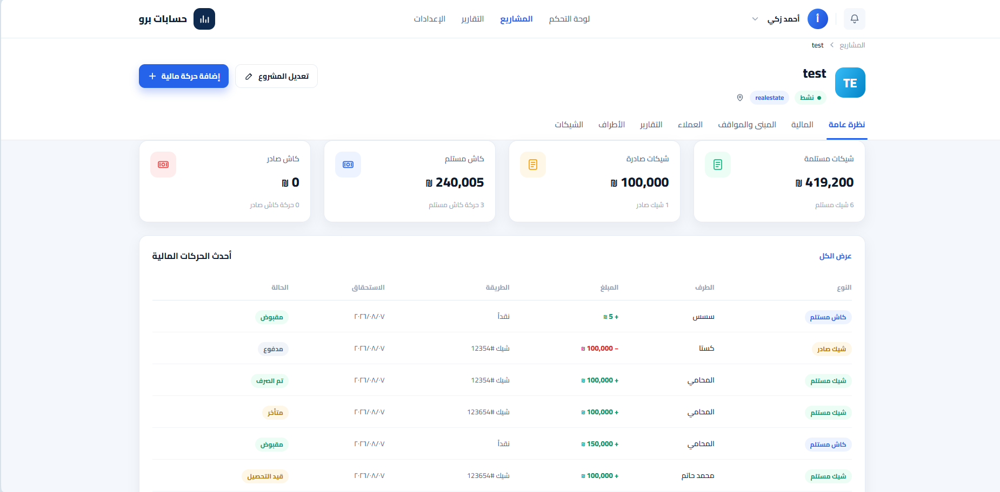
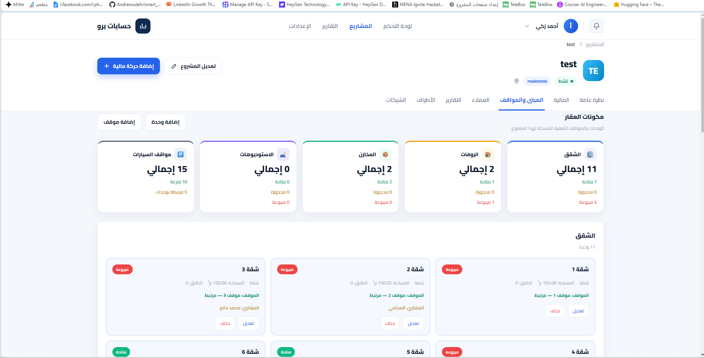
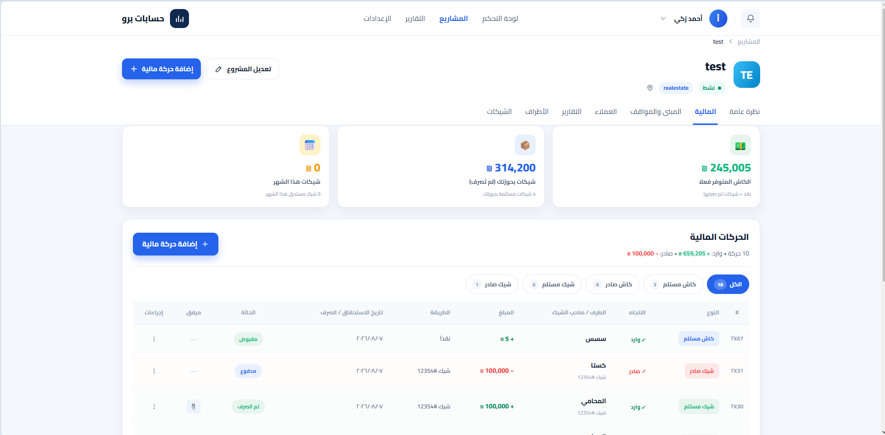
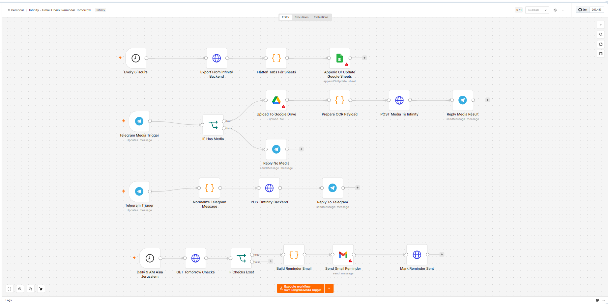

# Hesabat Pro

Hesabat Pro is a full-stack project and financial management system designed to centralize project operations, financial activity, customers, business parties, units, payments, cheques, and reporting.

The platform combines an Arabic-first React interface with a FastAPI and PostgreSQL backend, along with an n8n automation layer for operational workflows and external service integrations.

## Overview

Hesabat Pro provides a dedicated workspace for each project, allowing users to manage operational and financial data from a single system.

The platform currently supports multiple project types, including:

- Real estate
- Restaurants
- Shops
- Cafes

Real-estate projects include dedicated modules for:

- **Overview** — Project status, balances, cheque summaries, and recent financial activity
- **Finance** — Incoming and outgoing financial transactions
- **Buildings and Parking** — Apartments, shops, warehouses, studios, and parking spaces
- **Customers** — Customer records and related activity
- **Parties** — Suppliers, contractors, customers, and other business parties
- **Cheques** — Cheque tracking, due dates, collection, and payment status
- **Reports** — Financial summaries and project-level reporting

The interface is designed primarily for Arabic users and supports right-to-left (RTL) layouts.

## Application Preview

### Project Overview

The project overview provides a consolidated view of incoming and outgoing cheques, cash movements, balances, and recent financial activity.



### Buildings and Units

Real-estate projects include dedicated management for apartments, shops, warehouses, studios, and parking spaces, including their availability and ownership status.



### Finance Management

The finance workspace provides transaction tracking, available cash, cheque information, payment status, and project-level financial activity.



## System Architecture

Hesabat Pro consists of three main layers:

### Frontend

The React application provides the Arabic-first user interface, project workspaces, financial management screens, customer and party management, unit management, cheque tracking, and reporting.

### Backend

The FastAPI backend exposes REST APIs, handles authentication and business logic, and manages persistent application data through PostgreSQL.

### Automation

The n8n automation layer extends the core application with scheduled operations and integrations with external services.

```text
                   React / Vite
                      Frontend
                         |
                      REST API
                         |
                      FastAPI
                      Backend
                         |
                     PostgreSQL
                         |
                        n8n
                    Automation
                         |
          +--------------+--------------+
          |              |              |
       Telegram      Google Drive    Google Sheets
                                         |
                                       Gmail
```

## Automation

Hesabat Pro includes an n8n automation layer connected to the backend API.

The automation currently handles:

- Scheduled backend data synchronization
- Google Sheets synchronization
- Telegram-based data submission
- Telegram media processing
- Google Drive file uploads
- Backend API integration
- Scheduled operational checks
- Automated email reminders
- Reminder status tracking

### Automation Workflow



## Typical Workflow

1. A user signs in to Hesabat Pro.
2. The projects dashboard displays existing projects and allows new projects to be created.
3. The user opens a project and accesses its dedicated workspace.
4. Financial and operational data is managed through the relevant modules.
5. The React frontend communicates with the FastAPI backend through REST APIs.
6. The backend processes application logic and persists data in PostgreSQL.
7. n8n handles scheduled operations and integrations with external services.

## Tech Stack

### Frontend

- React
- Vite
- JavaScript
- RTL interface support

### Backend

- Python
- FastAPI
- PostgreSQL
- SQLAlchemy
- Alembic
- JWT authentication

### Automation and Integrations

- n8n
- Telegram Bot API
- Google Sheets
- Google Drive
- Gmail
- REST APIs
- JavaScript
- JSON

## Project Structure

```text
hesabat-app/
│
├── frontend/
│   ├── src/
│   ├── index.html
│   ├── package.json
│   └── vite.config.js
│
├── backend/
│   ├── app/
│   ├── alembic/
│   ├── requirements.txt
│   └── .env.example
│
├── automation/
│   └── hesabat-pro-automation.json
│
├── docs/
│   └── images/
│       ├── project-overview.png
│       ├── buildings-units.png
│       ├── finance.png
│       └── automation-workflow.png
│
├── .gitignore
├── README.md
└── RUN.md
```

## Running the Frontend

From the project root:

```bash
cd frontend
npm install
npm run dev
```

The development server usually runs at:

```text
http://localhost:5173
```

## Running the Backend

The backend requires PostgreSQL.

From the project root:

```bash
cd backend

docker compose up -d

python -m venv .venv
.venv\Scripts\activate

pip install -r requirements.txt

copy .env.example .env

alembic upgrade head

uvicorn app.main:app --reload
```

The API is available at:

```text
http://127.0.0.1:8000
```

FastAPI interactive API documentation:

```text
http://127.0.0.1:8000/docs
```

Health check:

```text
http://127.0.0.1:8000/health
```

## Running the Automation

1. Open n8n.
2. Import `automation/hesabat-pro-automation.json`.
3. Configure the required credentials.
4. Set the Hesabat Pro backend API URL.
5. Configure the Telegram and Google service integrations.
6. Test the individual workflow paths.
7. Activate the required triggers and schedules.

## Security

Sensitive credentials and environment-specific configuration are not stored in this repository.

The following values must be configured locally:

- Database credentials
- JWT secrets
- Telegram bot tokens
- Google credentials
- API keys
- Environment-specific service URLs

Use `.env.example` files to document required environment variables without exposing real credentials.

## Additional Documentation

Additional setup and development instructions are available in [RUN.md](RUN.md).    